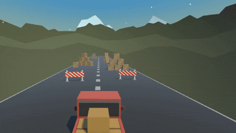
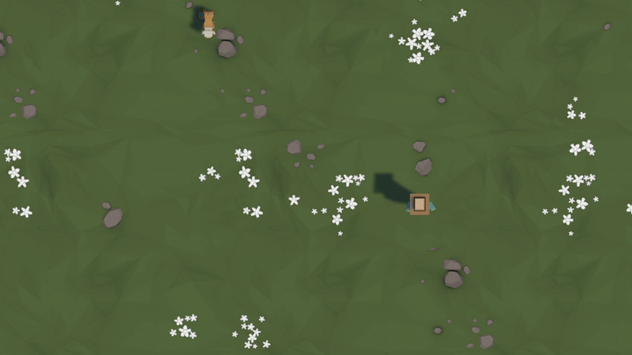
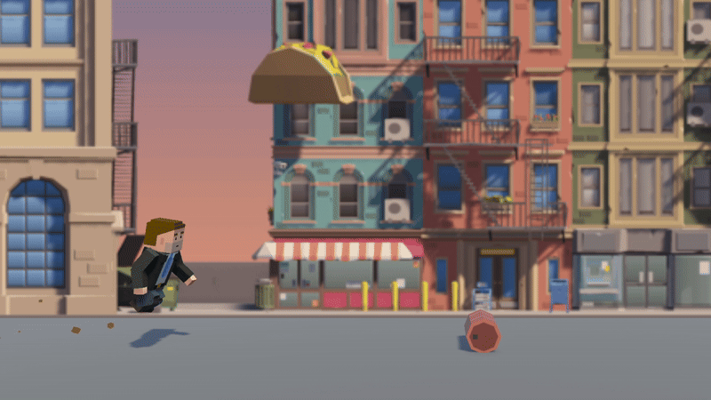

# Learning_Unity
Repository showcasing my Unity learning path with tutorials, pathway projects, and practice exercises.

Here is my Unity Learn profile:
https://learn.unity.com/u/5fe8e6ffedbc2a125b193502?tab=profile

---

## Get started with Unity DevOps
_Status: Ongoing_

learned to use Unity DevOps tools to set up a CI/CD pipeline for a Unity project, including:
- Unity Version Control

## Netcode for GameObjects

Learned to set up a basic co-op multiplayer game with Netcode for GameObjects, including player spawning, movement sync, RPCs, and connection modes (Host, Client, Server).

## Pathway Projects

### Junior Programmer – Prototype 1

Learned to make a simple 3D game with player movement and physics.

### Junior Programmer – Prototype 2

Learned to make a simple top-down 3D game with player movement, shooting, enemy spawning and out of bounds handling.

### Junior Programmer – Prototype 3

Learned to make a simple game with particle and sound effects.

## DOTS Best Practices
_Status: todo_

## Get started with Addressables
_Status: todo_
