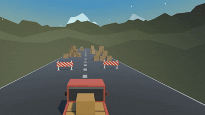

# Learning_Unity
Repository showcasing my Unity learning path with tutorials, pathway projects, and practice exercises.

Here is my Unity Learn profile:
https://learn.unity.com/u/5fe8e6ffedbc2a125b193502?tab=profile

---

## Netcode for GameObjects

Learned to set up a basic co-op multiplayer game with Netcode for GameObjects, including player spawning, movement sync, RPCs, and connection modes (Host, Client, Server).  

## Pathway Projects

### Junior Programmer – Prototype 1

Learned to make a simple 3D game with player movement and physics.

### Junior Programmer – Prototype 2

Learned to make a simple top-down 3D game with player movement, shooting, enemy spawning and out of bounds handling.

